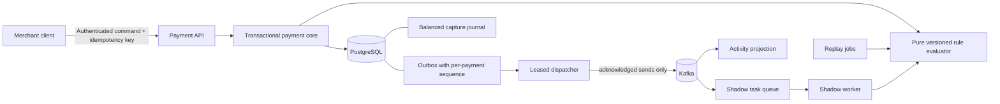

# DecisionRail

[](https://github.com/beaprogram/Decision-Rail/actions/workflows/verify.yml)

**Explainable payment decisions. Durable retries. Verifiable accounting.**

DecisionRail is a Java payment decisioning and resilience portfolio project. It answers a deceptively difficult question: **when a payment request is retried, races another request, or is declined, can we explain the outcome and prove that the money state is still correct?**

It now answers a second one: **when the broker is down, a worker dies mid-send, or someone wants to change a rule, what happens to the committed events and to the money?** A third: **can an operator open a browser and see why a payment got the decision it did, how a different policy compares, and whether delivery is healthy?** And a fourth: **when money has to go back, how is that recorded without rewriting what already happened — and how would anyone know if the books stopped agreeing?**

The transactional payment core handles synthetic funds with merchant isolation, concurrency-safe authorizations, durable idempotency, versioned policy decisions, and a balanced capture journal. On top of that, committed events are delivered to Kafka in per-payment order with idempotent consumers, candidate policies can be replayed against real history or evaluated alongside live traffic without touching it, and the new dependencies have explicit, tested failure behaviour. All of it is now usable through an operator console served by the same application.

**Status:** **9 of 10 scope checkpoints complete; the tenth is packaged, rehearsed and published but never deployed live - there is no public URL** · Java 21 · Spring Boot 3.5.16 · PostgreSQL 16 · Kafka 3.9 · React 19 + TypeScript

The scope checkpoints are equally weighted planning units, not a measure of effort or production readiness. The last one - a public demo on a zero budget - is built for two hosting targets, rehearsed in its deployed shape, published as inspectable images and given an executable acceptance harness; it was never deployed to a live instance, and that is where it is closed rather than left open. See the [delivery ledger](docs/roadmap.md) for the exact boundary and [PROGRESS.md](docs/PROGRESS.md) for the material limitations.

## Try it

**Everything in this system is synthetic.** No real account, card, bank or payment network is involved anywhere, and the risk policy is a demonstrator, not a fraud model.

- **Public demo:** *never deployed.* There is no public URL, and nothing here should be read as implying one. Two targets are packaged instead: [`deploy/`](deploy/) runs the whole stack with Compose on a single always-free host, and [`deploy/render/`](deploy/render/) packages the application with its own supervised edge for a free container platform with managed PostgreSQL and Kafka over TLS and SASL. Both are assessed with sources in [docs/hosting.md](docs/hosting.md); both have published, anonymously pullable images with their digests recorded in [verification.md](docs/verification.md); and the live acceptance checks are executable (`deploy/render/live-check.py`), rehearsed 45 for 45 against disposable infrastructure and never run against a managed one. Two release reviews found ten configuration and recovery defects, fixed in `v0.10.1` and `v0.10.2` ([release notes](docs/release-notes.md)). What is missing is the owner dashboard work and one live run, not code.
- **Recorded walkthrough:** the visitor path and a separate, labelled operator segment, recorded against the deployed configuration - the videos are on [the v0.10.0 release](https://github.com/beaprogram/Decision-Rail/releases/tag/v0.10.0) and the script is in [docs/walkthrough.md](docs/walkthrough.md).
- **Release image:** `ghcr.io/beaprogram/decision-rail:v0.10.1` (pin deployments to its `sha-<commit>` tag), public, a multi-platform index with arm64 and amd64 children; `GET /actuator/info` on any instance says which commit it is.
- **Run it yourself:** the local stack below starts in a few minutes on Docker.

### The guided demo path

Sign in as the shared **visitor** merchant (the sign-in page shows the credential and says, plainly, that every visitor shares this merchant's state). Then:

1. **Payments** - the seeded history. Filter to `DECLINED` in CAD and open one: the stored decision names the rule that fired. Filter to `DECLINED` in USD and open one: the policy *approved* it and it was declined for funds. Those are different things and are shown as different things.
2. **New authorization** - 42.00 on the second CAD account, review, authorize. Open it: `APPROVE`, `AUTHORIZED`, funds held.
3. **Capture** - the capture journal appears: one balanced debit/credit pair, sealed.
4. **Refund 15.00** with a reason - a return operation with its own compensating journal; the capture is untouched.
5. **Reconciliation** - read-only; it says what it examined and that it agreed.
6. **Policy replay** - the seeded job replayed the visitor's history against a stricter candidate; filter to the divergences.
7. **Shadow comparisons** - the candidate's disagreement recorded beside a live decision it did not change.

The visitor can do all of that and cannot register policies, configure shadow evaluation, redrive delivery or read another merchant's data - on either API, not only in the console. Those are shown in the operator segment of the recording.

## What is implemented

| Capability | Concrete behavior |
| --- | --- |
| Payment lifecycle | Authorize synthetic funds, capture an authorization, or void it and release its hold. |
| Refunds and reversal | Return captured money in part, repeatedly, or reverse a capture outright. Both draw on one capped budget, so a payment can never credit back more than it captured even when returns race. A reversal is refused once anything has been returned rather than silently becoming a refund of the remainder. |
| Financial correction | A return is a new operation with its own balanced compensating journal, linked to the payment and the capture. The original authorization, capture amount and capture journal are untouched and stay sealed; the database rejects every attempt to edit them. |
| Reconciliation | A read-only report that rebuilds expected balances from the ledger and cross-checks each payment's returned total against its return operations and their journals. It reports discrepancies with expected, actual, delta, currency and supporting references — and never repairs, rewrites, or mutates anything it finds. |
| Retry safety | Every mutation requires a merchant-scoped `Idempotency-Key`; the same request replays its durable result, while conflicting key reuse returns `409`. |
| Concurrency control | Database locks and constraints protect available funds and competing payment transitions. |
| Accounting evidence | Capture writes one balanced debit/credit journal, and each return writes one compensating journal that reverses it. Database constraints verify exactly two entries matching the operation's amount, currency, merchant and both ledger accounts in the correct direction; sealed journals reject later additions, updates, and deletes. |
| Explainable decisions | The stored decision contains the ruleset version, outcome, score, matched reasons, and flags. |
| Tenant isolation | Merchant authentication and ownership checks protect payment, account, and ledger reads and writes. |
| Durable event intent | Outbox records commit with payment state, carrying a per-payment sequence assigned under the payment row lock. |
| Ordered event delivery | A leased dispatcher publishes to Kafka outside the payment transaction. An event is only sent once its predecessor for that payment has been acknowledged, so a later lifecycle event cannot overtake an unfinished earlier one. |
| Outage tolerance | Payment commands keep working while the broker is down, and keep working across a restart during that outage. Intent accumulates, delivery resumes with the original event identity, and backlog age is reported. |
| Idempotent consumption | A consumer commits its deduplication record and its read-model change in one transaction, then acknowledges the offset. Duplicate, malformed, unsupported-schema, conflicting-identity, and unknown-tenant records are each handled explicitly. |
| Immutable policies | Candidate versions are content-addressed; a version id cannot be rebound to a different definition. Candidates are never authoritative. |
| Historical replay | A job pins a candidate and materialises its inputs, so results are reproducible, membership cannot shift, and an interrupted job resumes without inflating totals. |
| Shadow evaluation | A pinned candidate is evaluated from committed authorization events. It cannot reserve funds, capture, write a ledger entry, change a decision, or emit an event, and architecture tests enforce that. |
| Resilience controls | Bounded send deadlines, a documented retry budget, a circuit breaker at the broker boundary, bounded batches and workers, and liveness, readiness, and degraded asynchronous capability as three separate signals. |
| Outage-tolerant startup | The application starts and takes payments with the broker unreachable, including when its name does not resolve. Listeners start off the startup path and retry, so delivery resumes on its own without a second restart, and degraded asynchronous capability is reported rather than implied. |
| Repeatable delivery | Database migrations with a verified upgrade path, PostgreSQL and Kafka integration verification, CI, Docker configuration, and four executable demos — including a restart-recovery demonstration that kills the application with an event pending and brings a new process up against the same database with the broker still down. |

This is an independent educational implementation. It does not process real money or integrate with a card network. Its synthetic policy is a demonstrator, not a trained fraud model or a compliance screen.

## Architecture



One Spring Boot application owns the transaction boundary. What the diagram deliberately lacks is any arrow from Kafka, the shadow worker, or a replay job back into the payment core or the ledger: evaluating a candidate policy cannot move money, and architecture tests assert those dependencies stay absent.

**The delivery guarantee is at-least-once with idempotent consumer effects**, not exactly-once across PostgreSQL and Kafka. A crash between a broker acknowledgement and the outbox update resends; consumers deduplicate by event id. The [architecture guide](docs/architecture.md) enumerates every remaining failure window, and the ADRs cover the [transactional core](docs/adr/0001-transactional-core.md), [delivery and ordering](docs/adr/0002-outbox-delivery-and-ordering.md), [policy snapshots, replay, and shadow](docs/adr/0003-policy-snapshots-replay-and-shadow.md), [resilience boundaries](docs/adr/0004-resilience-boundaries.md), and [returns, reconciliation, and recovery](docs/adr/0007-returns-reconciliation-and-recovery.md).

## Run locally

**Prerequisites:** Docker Engine with Compose. The demo scripts also need Bash, OpenSSL, `curl`, and `jq`. Building outside Docker requires JDK 21; the checked-in Maven wrapper downloads pinned Maven 3.9.12 and, for the dashboard, pinned Node 22.14.0 on its first run. Working on the frontend directly needs Node 20.19 or later installed locally.

```bash
git clone https://github.com/beaprogram/Decision-Rail.git
cd Decision-Rail
./scripts/prepare-local-env.sh
docker compose up --build -d
docker compose logs -f backend
```

Wait for the application to start, then in another terminal:

```bash
curl --fail http://localhost:8080/actuator/health
./scripts/demo.sh        # transactional lifecycle: 12 checks
./scripts/async-demo.sh  # delivery, replay, shadow, failure and recovery: 27 checks
```

Then open the operator console at **<http://localhost:8080/dashboard/>** and sign in with a username
from the table below and its password from the generated `.env`.

| Sign in as | What the console offers |
| --- | --- |
| `demo-merchant` or `other-merchant` | Payment search, payment detail with its stored decision and lifecycle, authorize, capture, void, accounts, policy replay, shadow comparisons |
| `admin` | Policy versions and candidate registration, event delivery health, failed events and redrive, shadow configuration |
| `operations` | Nothing. It remains the metrics-only identity and the console says so rather than widening it. |

The dashboard is built into the application jar, so there is no second thing to deploy and no CORS to
configure: it is served from the same origin as the API it calls. The browser uses a session cookie
with CSRF protection on a separate security chain from the scripted Basic-auth API; see
[ADR 0005](docs/adr/0005-browser-session-authentication.md) for why they are separate and what the
limitations are.

The setup script generates local passwords in an ignored `.env` file with owner-only permissions. Existing credentials are preserved. Application startup requires four distinct passwords of 16–72 characters and rejects missing or placeholder credentials. Compose binds the database, broker, and API to `127.0.0.1`. Demo seeding is enabled explicitly by Compose.

If ports `5432`, `19092`, or `8080` are taken locally, override the host ports rather than editing the file:

```bash
DB_PORT=55434 KAFKA_PORT=19093 BACKEND_PORT=8080 docker compose up --build -d
```

The first demo verifies authorization, identical retry replay, conflicting key rejection, capture, capture retry, a balanced journal, stored decision retrieval, void, and final account balances. Each run captures **CAD 25.00 of synthetic funds**.

The second **stops the broker container** and shows a payment authorized during the outage, retained event intent with the breaker open and asynchronous delivery reporting DEGRADED while readiness stays UP, delivery resuming after restart with the original event id, one projection effect after the same event is delivered twice more, a replay job whose membership does not shift when a later payment commits, a `409` when a policy version is rebound to different content, and a shadow divergence that leaves balances, holds, journals, decisions, and events untouched. Both are intended for an otherwise idle local demo instance.

The broker is a **single-node development deployment** with replication factor 1. It is not highly available: a restart is a delivery outage and a lost volume is lost events. The outbox is what makes that survivable.

```bash
docker compose down
```

Stopping the stack preserves the named PostgreSQL volume. New credentials do not change an already initialized database password; keep the generated `.env` with its matching volume.

For native development, testing, and operational detail, see the [operator guide](docs/operator-guide.md).

## API at a glance

The [OpenAPI 3.1 contract](docs/openapi.yaml) defines request validation, response schemas, authentication, error cases, and retry behavior. The concise [progress record](docs/PROGRESS.md) is the handoff for the next implementation session.

All `/v1/**` routes require HTTP Basic authentication. Four identities have non-overlapping authority: `demo-merchant` and `other-merchant` reach their own data; `operations` can only read `/actuator/prometheus`; `admin` reaches `/v1/ops/**` and policy creation and cannot call merchant APIs. The metrics-only account was deliberately not widened into an administrator, and privileged routes are matched before the broad merchant rule so they cannot fall through to it. Use TLS before exposing Basic authentication outside the local machine. Token-based authentication and its operational lifecycle belong to a later release.

| Method | Path | Purpose |
| --- | --- | --- |
| `POST` | `/v1/payments/authorizations` | Evaluate a payment and attempt to reserve funds. |
| `POST` | `/v1/payments/{id}/capture` | Capture an existing authorization; no request body. |
| `POST` | `/v1/payments/{id}/void` | Release an existing authorization; no request body. |
| `GET` | `/v1/payments/{id}` | Read lifecycle state and original decision evidence. |
| `GET` | `/v1/payments/{id}/ledger` | Read the payment's journal entries: the capture, plus one per return. |
| `POST` | `/v1/payments/{id}/refunds` | Return part or all of a captured payment. The amount is required and exact. |
| `POST` | `/v1/payments/{id}/reversal` | Reverse a capture in full. States no amount; refused once anything has been returned. |
| `GET` | `/v1/payments/{id}/returns` | Captured, returned and remaining amounts, and every return with its journal. |
| `GET` | `/v1/reconciliation` | Check that your own recorded money agrees with the evidence for it. Read-only. |
| `GET` | `/v1/accounts/{id}` | Read currency, balance, held funds, and available funds. |
| `GET` | `/v1/rules/active` | Inspect the active synthetic policy. |
| `GET` | `/v1/payments/{id}/activity` | Read the event-derived activity projection for a payment. |
| `GET` | `/v1/activity` | List recent projected activity for the caller. |
| `POST` | `/v1/policies` | Register an immutable candidate policy version. Admin only. |
| `GET` | `/v1/policies`, `/v1/policies/{versionId}` | Read stored policy versions in canonical form. |
| `POST` | `/v1/replay-jobs` | Create a replay job against a pinned candidate; membership is materialised now. |
| `GET` | `/v1/replay-jobs/{id}`, `/report`, `/results` | Job progress, the comparison report, and per-payment explanations. |
| `GET` | `/v1/payments/{id}/shadow`, `/v1/shadow-comparisons` | Shadow comparisons the caller owns. |
| `GET` | `/v1/ops/outbox/backlog` | Delivery backlog, terminal failures, blocked streams, breaker state. Admin only. |
| `POST` | `/v1/ops/outbox/redrive` | Return failed events to the pending pool, preserving identity. Admin only. |
| `GET`, `PUT` | `/v1/ops/shadow` | Read or change shadow configuration. Admin only. |
| `GET` | `/v1/ops/reconciliation` | Reconcile any named merchant. Admin only; a separate service method from the merchant one. |
| `GET` | `/actuator/health` | Public service health without internal details. |
| `GET` | `/actuator/health/liveness`, `/readiness`, `/async` | Process liveness, payment-traffic readiness, and degraded asynchronous capability. |

Example authorization body:

```json
{
  "accountId": "11111111-1111-1111-1111-111111111111",
  "amountMinor": 2500,
  "currency": "CAD",
  "country": "CA"
}
```

Send a fresh `Idempotency-Key` for each distinct command. Reuse that same key and request when retrying a command. A successful creation returns `201`; capture and void return `200`. Replayed results carry `Idempotency-Replayed: true` and return the original command snapshot, even after a later capture or void. Read the payment with `GET` when you need current state.

Money uses integer minor units: `2500` is CAD 25.00. The account currency must match the payment currency; this release supports CAD and USD and performs no foreign exchange conversion.

Returning money works the same way, with one rule worth stating up front: **a refund names its amount**. There is no "refund whatever is left" request, because the remainder changes as other refunds commit and an idempotency key whose meaning drifts is worse than no key at all. Read `remainingRefundableMinor` and send that number.

```bash
# What can still come back
curl -u "demo-merchant:$MERCHANT_DEMO_PASSWORD" \
  "http://localhost:8080/v1/payments/$payment/returns"

# A partial refund. Repeat with the same key and body to get the original receipt back.
curl -u "demo-merchant:$MERCHANT_DEMO_PASSWORD" \
  -H 'Content-Type: application/json' -H "Idempotency-Key: refund-001" \
  -d '{"amountMinor":1500,"reason":"customer returned one item"}' \
  "http://localhost:8080/v1/payments/$payment/refunds"
```

A refund leaves the payment `CAPTURED`. The capture happened and its journal is sealed evidence of it; what records the money coming back is the returned total and a new compensating journal, not a changed status. `./scripts/lifecycle-demo.sh` walks the whole path in 26 checks.

## Decision semantics

The active `demo-v1` policy is deliberately transparent:

| Signal | Score contribution |
| --- | --- |
| Synthetic test country `ZZ` | 100 and a terminal decline |
| Amount ≥ 500,000 minor units | 60 |
| Amount ≥ 100,000 and < 500,000 minor units | 30 |
| Country differs from demo home country `CA` | 20 |

Scores `0–29` approve, `30–59` require review, and `60+` decline. The amount bands are mutually exclusive. An approved policy decision can still fail to reserve funds: the payment is then `DECLINED` with `failureCode: INSUFFICIENT_FUNDS`, while the stored risk outcome remains `APPROVE`. Separating risk evaluation from funds availability preserves an accurate explanation.

`REVIEW` does not reserve funds and has no manual approval workflow in this milestone. Capture and void apply to authorized payments.

### Comparing a different policy

A candidate policy varies rules: their codes, expressions, score contributions, flags, terminal behaviour, and order. It cannot move the `30`/`60` thresholds or define new flags, because then a divergence could not be attributed to the rules rather than to a relabelled scale. Expressions come from a closed operator set that maps onto a sealed Java type, so a policy document cannot contain a script, reach the network, or cause reflection; an unknown operator is rejected rather than ignored.

If matched contributions sum above 100 the score is capped at 100, the cap is recorded, and the explanation still reconciles against the uncapped raw total. Rejecting such policies up front would require deciding which rule combinations are jointly reachable, which the built-in policy itself would fail: its contributions sum to 210 but it can never exceed 80 in practice.

Comparisons use the **stored risk decision**, never the payment's lifecycle status. A payment declined for insufficient funds recorded `APPROVE` and is compared as `APPROVE`. Reports state their divergence denominator, label how timings were measured, and record that no labelled outcome data exists, so no precision, recall, or false-positive rate is reported anywhere.

## Verification

Infrastructure behaviour is verified against real PostgreSQL and a real Kafka broker, from a dedicated disposable stack on non-default loopback ports. These checks are never skipped: an unavailable dependency fails the run rather than quietly passing.

```bash
docker compose -f compose.test.yaml up -d --wait
./mvnw --batch-mode --no-transfer-progress verify
```

The test profile already defaults to that stack. Use a dedicated database and broker: integration tests install triggers that inject storage failures, publish synthetic events, and create a throwaway database for the migration upgrade check.

Local verification on **2026-09-23 UTC**, on revision `e000c1a`, passed **408 backend tests**, **42 frontend unit tests** and **54 browser end-to-end tests** against PostgreSQL 16.15 and a single-node KRaft Kafka 3.9.1, with zero failures, errors or skipped tests. The browser suite runs with **retries disabled**, locally and in CI, so a first-attempt failure cannot be hidden by a passing retry; all 54 passed on the first attempt. The packaged application passed **12** transactional demo checks, **26** lifecycle and reconciliation demo checks, **27** asynchronous demo checks, and **16** restart-recovery checks on a disposable stack of its own. That run used the machine's JVM 25.0.1 rather than the Java 21 the build targets, because 21 was not installed on it; CI exercises the documented toolchain on every pushed revision. The per-group breakdown, and the first-attempt failures recorded rather than absorbed, are in the [verification guide](docs/verification.md).

The browser tests run a real Chromium against the packaged application with real PostgreSQL and Kafka. They sign in and out, prove one merchant cannot reach another's data even when a response from the previous identity arrives late, authorize and capture and void, register a candidate policy and read back its validation errors, run a replay to completion, observe a shadow divergence, inspect and redrive a failed event, and stop the broker to watch delivery degrade while payment reads stay available. They also sign in and out repeatedly on one page without reloading it, since a reload obtains a fresh CSRF token as a side effect and would hide a broken transition; and they let the server commit a command and then drop its response, to check that the retry resends the submitted bytes rather than whatever the form holds by then. Refunds are exercised the same way: a partial refund then the remainder, a reversal and its refusal after a partial refund, an amount above what remains, excess decimal precision, and a refund whose response is dropped after it commits, where the retry must carry the same key and the same bytes and must not return the money twice.

Timing-sensitive behaviour is tested with injected clocks, explicit failpoints, and bounded polling rather than sleeps. A test named for recovery leaves behind exactly the state a killed process leaves, so recovery has to happen through durable state and lease expiry. The [verification guide](docs/verification.md) explains the failure cases and why real infrastructure matters.

[The remote run](https://github.com/beaprogram/Decision-Rail/actions/runs/34719181973) passed the backend, frontend, and browser suites plus the demos on revision `4754fab`, against PostgreSQL 16 and Kafka. CI configuration in the repository is not itself evidence that a remote run has passed; inspect the workflow result for the revision you care about.

## Operator console

Eight screens, all against real data from the same application:

- **Payments.** Authoritative search over committed payments with filters for status, risk outcome, currency, account, and creation time. A payment is findable the moment its transaction commits, including while the broker is down and nothing has been delivered. Paging is by keyset cursor, so a payment created mid-paging cannot shift a boundary and hide a row.
- **Payment detail.** The stored decision that produced the outcome: risk outcome, score, policy version, flags, and every reason contribution. A funding decline is presented separately from a policy decline, because an APPROVE risk decision sitting next to a DECLINED payment is a normal, correct combination. Plus the capture journal and a lifecycle that keeps the payment transaction, broker publication, and each consumer group's own record distinct.
- **Authorize, capture, void.** Typed amounts convert to integer minor units exactly, never by multiplying a float. Each command carries one idempotency key reused across retries, and a timed-out command is reported as an unknown outcome rather than a failure.
- **Refunds and reversal.** Captured, returned and remaining amounts, a refund form bounded by what is actually left, a "refund everything remaining" control that fills the exact amount rather than sending a request meaning "whatever is left", and the return history with each operation's linked journal. Eligibility comes from the server, including the reason an action is unavailable; the browser never re-derives a financial rule. Retries behave exactly as they do for a capture: the same key, the same bytes, and authoritative state re-read afterwards.
- **Reconciliation.** Whether recorded money agrees with the evidence for it, with each finding's expected value, actual value, difference, currency and supporting references. The report states its snapshot, the checks it performed and what it cannot establish, and it is never described as clean when only part of the population was examined. It is read-only, and the screen offers nothing that would change anything.
- **Accounts.** Balance, held, and available per account, subtotalled per currency and never combined across them.
- **Policy versions.** Immutable versions with their rules, order, conditions, contributions, flags, and terminal behaviour. Administrators register candidates through a validated editor that surfaces the server's field paths.
- **Policy replay and shadow.** Compare a candidate against real history or alongside live authorizations, with baseline and candidate explanations side by side and the divergence denominator stated.
- **Event delivery.** Liveness, readiness, and asynchronous capability as three distinct signals, plus backlog counts, stalled payment streams, and a redrive control that requires an explicit selection.

## Telemetry and measured performance

One synthetic payment can be followed from its HTTP command through the durable event it committed,
each publication attempt, the broker record, and the committed projection effect — after a restart,
because the trace of the command is written beside the event in the same transaction rather than held
in a thread. Structured JSON logs carry the same identifiers, and the
[metric catalogue](docs/observability.md) documents every series, its units, its bounded labels and how
fresh it is. An optional local Prometheus, Tempo and Grafana stack is provisioned in source control.

Performance is measured, not asserted, against criteria written down before the runs. On one laptop
with everything colocated, the system sustains **25 business operations per second (50 HTTP requests/s)**
across three repetitions with **zero dropped iterations**, zero failures and a backlog that clears in
3–10 seconds. **30/s is the nearby failing level**, and it fails intermittently: two repetitions passed
and the third dropped 21 iterations with p95 quadrupling. Through a 25-second broker outage under load,
**zero of 3000 requests failed** and the backlog cleared 22 seconds after the broker was reachable
again. The method, the environment, the ceiling and the limitations are in
[performance.md](docs/performance.md); the harness is in [benchmarking.md](docs/benchmarking.md).

## Deploying it

[`deploy/render/`](deploy/render/) holds the managed-services target: one image carrying the application and a supervised Caddy that terminates the platform's port, a Spring profile that forwards TLS and SASL settings to the real Kafka factories, a 512 MiB memory budget, and `live-check.py`, which executes the guide's acceptance checks against a deployed instance instead of listing them. Its image is published by a manually dispatched workflow under a separate `render-sha-` tag, so it never replaces the standalone application's releases.

[`deploy/`](deploy/) holds the Compose deployment: a Compose file with persistent storage and per-container memory limits, Caddy for automatic HTTPS, a cloud-init for the host, and scripts that prepare secrets, deploy a pinned image, seed the guided history, report health, back up, restore, roll back, reset the sandbox and tear down. The image is published to GHCR by [the release workflow](.github/workflows/release.yml) with the commit stamped into it. [deploy/README.md](deploy/README.md) is the runbook, including the owner actions and the honest limits: one instance with in-memory sessions (a restart signs everyone out), one broker with replication factor 1, and a rollback that stops at a migration boundary.

## Security, hosting, persistence and availability - the limits

- **Access.** On the public instance one shared visitor merchant with a public password, budgeted on the server on both APIs (commands per minute, replay jobs per hour and in flight, reconciliation reports per minute, payments per account); four private identities whose credentials exist only on the host; failed sign-ins limited per address; `Secure` session and CSRF cookies behind a proxy that is the only way in; fault injection refused at startup. There is no per-visitor isolation and no account creation: visitors share synthetic state, and the page says so.
- **Hosting.** Zero budget, enforced by the account type rather than by a spending alert. The chosen host may stop an idle instance after a week; it can be restarted and its data is still there. See [docs/hosting.md](docs/hosting.md).
- **Persistence.** PostgreSQL on a persistent volume is the system of record and is what backups cover. The broker is one node: acknowledged events lost with its volume are not reconstructed.
- **Availability.** None is claimed. Single instance, single broker, a free tier.
- **Recovery and rollback.** Backup is coherent by construction - the application is stopped and both consumer groups at zero lag before the dump - and restore resets the broker to the recovery point and leaves the application stopped; everything after the recovery point is discarded, and the runbook says so. A rollback across a migration boundary is one command that restores first and never lets the newer image touch the restored data. All rehearsed with real images, including the failure paths.

Redis features, candidate policy promotion and a highly available broker are **not included**. Neither are settlement rails, merchant liquidity accounts, chargebacks, or foreign exchange: returns move money between synthetic accounts that already exist. [PROGRESS.md](docs/PROGRESS.md) lists the material limitations of what is shipped and [release-notes.md](docs/release-notes.md) summarises this release.

## Portfolio value

The core demonstrates decisions that can be inspected and defended in a technical interview: why retries need durable request identity, why account locks protect against double spending, why journal balance is checked at commit, and why event intent belongs in the payment transaction.

The extended lifecycle adds a third conversation, and it is the one a payments interview usually reaches eventually. What a second money movement does to a schema that assumed exactly one. Why a correction is a compensating entry rather than an edit, and what the database has to refuse for that to be true. How a shared budget stays capped when two refunds race. What "reversal" is allowed to mean once part of a capture has already come back. How an idempotent response stays historical when the thing it describes has moved on. And what a reconciliation report can honestly claim when every record it compares lives in the same database.

The asynchronous work adds the harder conversation. Why a database commit and a broker publish cannot be made atomic, and what is left over. What actually establishes event order once you accept that timestamps, random ids, partition keys, and `SKIP LOCKED` do not. Why a failed event blocking one payment's stream is better than quietly dropping it. How a read model survives redelivery. How a rule change can be measured against real history without touching it. And why a broker outage should degrade one capability rather than take a correct payment API out of rotation.

DecisionRail focuses on transactional business correctness. A complementary project such as FaultScope can focus on discovering dependencies, controlled failures, observability, and incident diagnosis across a distributed system. Together they tell two distinct engineering stories: building a reliable transaction boundary and investigating how a distributed system fails.
