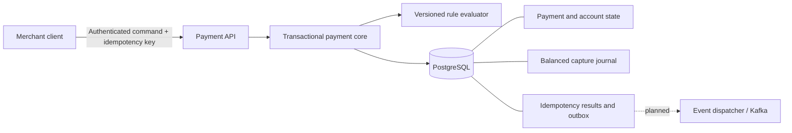

# DecisionRail

[](https://github.com/beaprogram/Decision-Rail/actions/workflows/verify.yml)

**Explainable payment decisions. Durable retries. Verifiable accounting.**

DecisionRail is a Java payment decisioning and resilience portfolio project. It answers a deceptively difficult question: **when a payment request is retried, races another request, or is declined, can we explain the outcome and prove that the money state is still correct?**

The initial delivery implements a transactional payment core with synthetic funds. It combines merchant isolation, concurrency-safe authorizations, durable idempotency, versioned policy decisions, and a balanced capture journal. The longer roadmap adds event delivery, replay, resilience experiments, operational tooling, and a free-budget public demo.

**Status:** initial milestone · **3 of 10 planned scope checkpoints** · Java 21 · Spring Boot 3.5.16 · PostgreSQL 16

“Approximately 30%” refers to those equally weighted scope checkpoints, not elapsed effort or production readiness. See the [delivery ledger](docs/roadmap.md) for the exact boundary.

## What is implemented

| Capability | Concrete behavior |
| --- | --- |
| Payment lifecycle | Authorize synthetic funds, capture an authorization, or void it and release its hold. |
| Retry safety | Every mutation requires a merchant-scoped `Idempotency-Key`; the same request replays its durable result, while conflicting key reuse returns `409`. |
| Concurrency control | Database locks and constraints protect available funds and competing payment transitions. |
| Accounting evidence | Capture writes one balanced debit/credit journal. Database constraints verify exactly two entries matching the captured payment; sealed journals reject later additions, updates, and deletes. |
| Explainable decisions | The stored decision contains the ruleset version, outcome, score, matched reasons, and flags. |
| Tenant isolation | Merchant authentication and ownership checks protect payment, account, and ledger reads and writes. |
| Durable event intent | Outbox records commit with payment state; event dispatch is a later milestone. |
| Repeatable delivery | Database migrations, PostgreSQL integration verification, CI, Docker configuration, and an executable operator demo. |

This is an independent educational implementation. It does not process real money or integrate with a card network. Its synthetic policy is a demonstrator, not a trained fraud model or a compliance screen.

## Architecture



One Spring Boot application owns the current transaction boundary. Payments, decisions, accounting, and access control have explicit responsibilities; they do not need cross-service writes to keep a capture consistent. The [architecture guide](docs/architecture.md) and [transactional core ADR](docs/adr/0001-transactional-core.md) explain the invariants and tradeoffs.

## Run locally

**Prerequisites:** Docker Engine with Compose. The demo script also needs Bash, OpenSSL, `curl`, and `jq`. Building outside Docker requires JDK 21; the checked-in Maven wrapper downloads pinned Maven 3.9.12 on its first run.

```bash
git clone https://github.com/beaprogram/Decision-Rail.git
cd Decision-Rail
./scripts/prepare-local-env.sh
docker compose up --build -d
docker compose logs -f backend
```

Wait for the application to start, then in another terminal:

```bash
curl --fail http://localhost:8080/actuator/health
./scripts/demo.sh
```

The setup script generates local passwords in an ignored `.env` file with owner-only permissions. Existing credentials are preserved. Application startup requires distinct passwords of 16–72 characters and rejects missing or placeholder credentials. Compose binds the database and API to `127.0.0.1`. Demo seeding is enabled explicitly by Compose.

The demo verifies authorization, identical retry replay, conflicting key rejection, capture, capture retry, a balanced journal, stored decision retrieval, void, and final account balances. Each run captures **CAD 25.00 of synthetic funds**. It is intended for an otherwise idle local demo instance.

```bash
docker compose down
```

Stopping the stack preserves the named PostgreSQL volume. New credentials do not change an already initialized database password; keep the generated `.env` with its matching volume.

For native development, testing, and operational detail, see the [operator guide](docs/operator-guide.md).

## API at a glance

The [OpenAPI 3.1 contract](docs/openapi.yaml) defines request validation, response schemas, authentication, error cases, and retry behavior. The concise [progress record](docs/PROGRESS.md) is the handoff for the next implementation session.

All `/v1/**` routes require HTTP Basic authentication. Local demo usernames are `demo-merchant` and `other-merchant`; passwords come from environment variables. The separate `operations` user can read `/actuator/prometheus` and cannot use the merchant API. Use TLS before exposing Basic authentication outside the local machine. Token-based authentication and its operational lifecycle belong to a later release.

| Method | Path | Purpose |
| --- | --- | --- |
| `POST` | `/v1/payments/authorizations` | Evaluate a payment and attempt to reserve funds. |
| `POST` | `/v1/payments/{id}/capture` | Capture an existing authorization; no request body. |
| `POST` | `/v1/payments/{id}/void` | Release an existing authorization; no request body. |
| `GET` | `/v1/payments/{id}` | Read lifecycle state and original decision evidence. |
| `GET` | `/v1/payments/{id}/ledger` | Read the captured payment's journal entries. |
| `GET` | `/v1/accounts/{id}` | Read currency, balance, held funds, and available funds. |
| `GET` | `/v1/rules/active` | Inspect the active synthetic policy. |
| `GET` | `/actuator/health` | Public service health without internal details. |

Example authorization body:

```json
{
  "accountId": "11111111-1111-1111-1111-111111111111",
  "amountMinor": 2500,
  "currency": "CAD",
  "country": "CA"
}
```

Send a fresh `Idempotency-Key` for each distinct command. Reuse that same key and request when retrying a command. A successful creation returns `201`; capture and void return `200`. Replayed results carry `Idempotency-Replayed: true` and return the original command snapshot, even after a later capture or void. Read the payment with `GET` when you need current state.

Money uses integer minor units: `2500` is CAD 25.00. The account currency must match the payment currency; this release supports CAD and USD and performs no foreign exchange conversion.

## Decision semantics

The active `demo-v1` policy is deliberately transparent:

| Signal | Score contribution |
| --- | --- |
| Synthetic test country `ZZ` | 100 and a terminal decline |
| Amount ≥ 500,000 minor units | 60 |
| Amount ≥ 100,000 and < 500,000 minor units | 30 |
| Country differs from demo home country `CA` | 20 |

Scores `0–29` approve, `30–59` require review, and `60+` decline. The amount bands are mutually exclusive. An approved policy decision can still fail to reserve funds: the payment is then `DECLINED` with `failureCode: INSUFFICIENT_FUNDS`, while the stored risk outcome remains `APPROVE`. Separating risk evaluation from funds availability preserves an accurate explanation.

`REVIEW` does not reserve funds and has no manual approval workflow in this milestone. Capture and void apply to authorized payments.

## Verification

Use a dedicated test database: rollback tests temporarily install database triggers, so an application must not use that database concurrently. With local PostgreSQL running, create the test database once:

```bash
docker compose exec database createdb -U decisionrail decisionrail_test
```

Then run the suite (skip database creation on later runs):

```bash
set -a
source .env
set +a
JDBC_URL=jdbc:postgresql://localhost:5432/decisionrail_test \
  ./mvnw --batch-mode --no-transfer-progress verify
```

Local verification on **2026-09-09 UTC** passed **83 tests** on Java 21.0.11 and PostgreSQL 14.19 with zero failures, errors, or skipped tests. The packaged application also passed all **12 operator-demo HTTP checks**. GitHub Actions targets PostgreSQL 16, then builds and starts the application container and runs the operator demo. The first remote run is still pending. The [verification guide](docs/verification.md) explains the failure cases and why database-backed tests matter. CI configuration in the repository is not itself evidence that a remote run has passed; inspect the workflow result for the pushed revision.

## What comes next

The next checkpoint delivers events from the outbox with retry and duplicate-delivery handling. Subsequent work adds historical replay and shadow evaluation, resilience controls, an operator interface, telemetry and reproducible performance measurements, extended financial lifecycle operations, and a public demo.

Kafka dispatch, Redis, replay/shadow evaluation, refunds, a frontend, measured throughput claims, and public deployment are **not included in this first milestone**. The [roadmap](docs/roadmap.md) tracks them explicitly.

## Portfolio value

The core demonstrates decisions that can be inspected and defended in a technical interview: why retries need durable request identity, why account locks protect against double spending, why journal balance is checked at commit, and why event intent belongs in the payment transaction.

DecisionRail focuses on transactional business correctness. A complementary project such as FaultScope can focus on discovering dependencies, controlled failures, observability, and incident diagnosis across a distributed system. Together they tell two distinct engineering stories: building a reliable transaction boundary and investigating how a distributed system fails.
