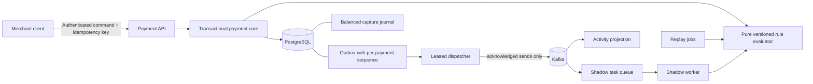

# DecisionRail

[](https://github.com/beaprogram/Decision-Rail/actions/workflows/verify.yml)

**Explainable payment decisions. Durable retries. Verifiable accounting.**

DecisionRail is a Java payment decisioning and resilience portfolio project. It answers a deceptively difficult question: **when a payment request is retried, races another request, or is declined, can we explain the outcome and prove that the money state is still correct?**

It now answers a second one: **when the broker is down, a worker dies mid-send, or someone wants to change a rule, what happens to the committed events and to the money?**

The transactional payment core handles synthetic funds with merchant isolation, concurrency-safe authorizations, durable idempotency, versioned policy decisions, and a balanced capture journal. On top of that, committed events are delivered to Kafka in per-payment order with idempotent consumers, candidate policies can be replayed against real history or evaluated alongside live traffic without touching it, and the new dependencies have explicit, tested failure behaviour.

**Status:** **6 of 10 planned scope checkpoints** · Java 21 · Spring Boot 3.5.16 · PostgreSQL 16 · Kafka 3.9

“Approximately 60%” refers to those equally weighted scope checkpoints, not elapsed effort or production readiness. See the [delivery ledger](docs/roadmap.md) for the exact boundary and [PROGRESS.md](docs/PROGRESS.md) for the material limitations.

## What is implemented

| Capability | Concrete behavior |
| --- | --- |
| Payment lifecycle | Authorize synthetic funds, capture an authorization, or void it and release its hold. |
| Retry safety | Every mutation requires a merchant-scoped `Idempotency-Key`; the same request replays its durable result, while conflicting key reuse returns `409`. |
| Concurrency control | Database locks and constraints protect available funds and competing payment transitions. |
| Accounting evidence | Capture writes one balanced debit/credit journal. Database constraints verify exactly two entries matching the captured payment; sealed journals reject later additions, updates, and deletes. |
| Explainable decisions | The stored decision contains the ruleset version, outcome, score, matched reasons, and flags. |
| Tenant isolation | Merchant authentication and ownership checks protect payment, account, and ledger reads and writes. |
| Durable event intent | Outbox records commit with payment state, carrying a per-payment sequence assigned under the payment row lock. |
| Ordered event delivery | A leased dispatcher publishes to Kafka outside the payment transaction. An event is only sent once its predecessor for that payment has been acknowledged, so a later lifecycle event cannot overtake an unfinished earlier one. |
| Outage tolerance | Payment commands keep working while the broker is down. Intent accumulates, delivery resumes with the original event identity, and backlog age is reported. |
| Idempotent consumption | A consumer commits its deduplication record and its read-model change in one transaction, then acknowledges the offset. Duplicate, malformed, unsupported-schema, conflicting-identity, and unknown-tenant records are each handled explicitly. |
| Immutable policies | Candidate versions are content-addressed; a version id cannot be rebound to a different definition. Candidates are never authoritative. |
| Historical replay | A job pins a candidate and materialises its inputs, so results are reproducible, membership cannot shift, and an interrupted job resumes without inflating totals. |
| Shadow evaluation | A pinned candidate is evaluated from committed authorization events. It cannot reserve funds, capture, write a ledger entry, change a decision, or emit an event, and architecture tests enforce that. |
| Resilience controls | Bounded send deadlines, a documented retry budget, a circuit breaker at the broker boundary, bounded batches and workers, and liveness, readiness, and degraded asynchronous capability as three separate signals. |
| Repeatable delivery | Database migrations with a verified upgrade path, PostgreSQL and Kafka integration verification, CI, Docker configuration, and two executable demos. |

This is an independent educational implementation. It does not process real money or integrate with a card network. Its synthetic policy is a demonstrator, not a trained fraud model or a compliance screen.

## Architecture



One Spring Boot application owns the transaction boundary. What the diagram deliberately lacks is any arrow from Kafka, the shadow worker, or a replay job back into the payment core or the ledger: evaluating a candidate policy cannot move money, and architecture tests assert those dependencies stay absent.

**The delivery guarantee is at-least-once with idempotent consumer effects**, not exactly-once across PostgreSQL and Kafka. A crash between a broker acknowledgement and the outbox update resends; consumers deduplicate by event id. The [architecture guide](docs/architecture.md) enumerates every remaining failure window, and the ADRs cover the [transactional core](docs/adr/0001-transactional-core.md), [delivery and ordering](docs/adr/0002-outbox-delivery-and-ordering.md), [policy snapshots, replay, and shadow](docs/adr/0003-policy-snapshots-replay-and-shadow.md), and [resilience boundaries](docs/adr/0004-resilience-boundaries.md).

## Run locally

**Prerequisites:** Docker Engine with Compose. The demo script also needs Bash, OpenSSL, `curl`, and `jq`. Building outside Docker requires JDK 21; the checked-in Maven wrapper downloads pinned Maven 3.9.12 on its first run.

```bash
git clone https://github.com/beaprogram/Decision-Rail.git
cd Decision-Rail
./scripts/prepare-local-env.sh
docker compose up --build -d
docker compose logs -f backend
```

Wait for the application to start, then in another terminal:

```bash
curl --fail http://localhost:8080/actuator/health
./scripts/demo.sh        # transactional lifecycle: 12 checks
./scripts/async-demo.sh  # delivery, replay, shadow, failure and recovery: 27 checks
```

The setup script generates local passwords in an ignored `.env` file with owner-only permissions. Existing credentials are preserved. Application startup requires four distinct passwords of 16–72 characters and rejects missing or placeholder credentials. Compose binds the database, broker, and API to `127.0.0.1`. Demo seeding is enabled explicitly by Compose.

If ports `5432`, `19092`, or `8080` are taken locally, override the host ports rather than editing the file:

```bash
DB_PORT=55434 KAFKA_PORT=19093 BACKEND_PORT=8080 docker compose up --build -d
```

The first demo verifies authorization, identical retry replay, conflicting key rejection, capture, capture retry, a balanced journal, stored decision retrieval, void, and final account balances. Each run captures **CAD 25.00 of synthetic funds**.

The second **stops the broker container** and shows a payment authorized during the outage, retained event intent with the breaker open and asynchronous delivery reporting DEGRADED while readiness stays UP, delivery resuming after restart with the original event id, one projection effect after the same event is delivered twice more, a replay job whose membership does not shift when a later payment commits, a `409` when a policy version is rebound to different content, and a shadow divergence that leaves balances, holds, journals, decisions, and events untouched. Both are intended for an otherwise idle local demo instance.

The broker is a **single-node development deployment** with replication factor 1. It is not highly available: a restart is a delivery outage and a lost volume is lost events. The outbox is what makes that survivable.

```bash
docker compose down
```

Stopping the stack preserves the named PostgreSQL volume. New credentials do not change an already initialized database password; keep the generated `.env` with its matching volume.

For native development, testing, and operational detail, see the [operator guide](docs/operator-guide.md).

## API at a glance

The [OpenAPI 3.1 contract](docs/openapi.yaml) defines request validation, response schemas, authentication, error cases, and retry behavior. The concise [progress record](docs/PROGRESS.md) is the handoff for the next implementation session.

All `/v1/**` routes require HTTP Basic authentication. Four identities have non-overlapping authority: `demo-merchant` and `other-merchant` reach their own data; `operations` can only read `/actuator/prometheus`; `admin` reaches `/v1/ops/**` and policy creation and cannot call merchant APIs. The metrics-only account was deliberately not widened into an administrator, and privileged routes are matched before the broad merchant rule so they cannot fall through to it. Use TLS before exposing Basic authentication outside the local machine. Token-based authentication and its operational lifecycle belong to a later release.

| Method | Path | Purpose |
| --- | --- | --- |
| `POST` | `/v1/payments/authorizations` | Evaluate a payment and attempt to reserve funds. |
| `POST` | `/v1/payments/{id}/capture` | Capture an existing authorization; no request body. |
| `POST` | `/v1/payments/{id}/void` | Release an existing authorization; no request body. |
| `GET` | `/v1/payments/{id}` | Read lifecycle state and original decision evidence. |
| `GET` | `/v1/payments/{id}/ledger` | Read the captured payment's journal entries. |
| `GET` | `/v1/accounts/{id}` | Read currency, balance, held funds, and available funds. |
| `GET` | `/v1/rules/active` | Inspect the active synthetic policy. |
| `GET` | `/v1/payments/{id}/activity` | Read the event-derived activity projection for a payment. |
| `GET` | `/v1/activity` | List recent projected activity for the caller. |
| `POST` | `/v1/policies` | Register an immutable candidate policy version. Admin only. |
| `GET` | `/v1/policies`, `/v1/policies/{versionId}` | Read stored policy versions in canonical form. |
| `POST` | `/v1/replay-jobs` | Create a replay job against a pinned candidate; membership is materialised now. |
| `GET` | `/v1/replay-jobs/{id}`, `/report`, `/results` | Job progress, the comparison report, and per-payment explanations. |
| `GET` | `/v1/payments/{id}/shadow`, `/v1/shadow-comparisons` | Shadow comparisons the caller owns. |
| `GET` | `/v1/ops/outbox/backlog` | Delivery backlog, terminal failures, blocked streams, breaker state. Admin only. |
| `POST` | `/v1/ops/outbox/redrive` | Return failed events to the pending pool, preserving identity. Admin only. |
| `GET`, `PUT` | `/v1/ops/shadow` | Read or change shadow configuration. Admin only. |
| `GET` | `/actuator/health` | Public service health without internal details. |
| `GET` | `/actuator/health/liveness`, `/readiness`, `/async` | Process liveness, payment-traffic readiness, and degraded asynchronous capability. |

Example authorization body:

```json
{
  "accountId": "11111111-1111-1111-1111-111111111111",
  "amountMinor": 2500,
  "currency": "CAD",
  "country": "CA"
}
```

Send a fresh `Idempotency-Key` for each distinct command. Reuse that same key and request when retrying a command. A successful creation returns `201`; capture and void return `200`. Replayed results carry `Idempotency-Replayed: true` and return the original command snapshot, even after a later capture or void. Read the payment with `GET` when you need current state.

Money uses integer minor units: `2500` is CAD 25.00. The account currency must match the payment currency; this release supports CAD and USD and performs no foreign exchange conversion.

## Decision semantics

The active `demo-v1` policy is deliberately transparent:

| Signal | Score contribution |
| --- | --- |
| Synthetic test country `ZZ` | 100 and a terminal decline |
| Amount ≥ 500,000 minor units | 60 |
| Amount ≥ 100,000 and < 500,000 minor units | 30 |
| Country differs from demo home country `CA` | 20 |

Scores `0–29` approve, `30–59` require review, and `60+` decline. The amount bands are mutually exclusive. An approved policy decision can still fail to reserve funds: the payment is then `DECLINED` with `failureCode: INSUFFICIENT_FUNDS`, while the stored risk outcome remains `APPROVE`. Separating risk evaluation from funds availability preserves an accurate explanation.

`REVIEW` does not reserve funds and has no manual approval workflow in this milestone. Capture and void apply to authorized payments.

### Comparing a different policy

A candidate policy varies rules: their codes, expressions, score contributions, flags, terminal behaviour, and order. It cannot move the `30`/`60` thresholds or define new flags, because then a divergence could not be attributed to the rules rather than to a relabelled scale. Expressions come from a closed operator set that maps onto a sealed Java type, so a policy document cannot contain a script, reach the network, or cause reflection; an unknown operator is rejected rather than ignored.

If matched contributions sum above 100 the score is capped at 100, the cap is recorded, and the explanation still reconciles against the uncapped raw total. Rejecting such policies up front would require deciding which rule combinations are jointly reachable, which the built-in policy itself would fail: its contributions sum to 210 but it can never exceed 80 in practice.

Comparisons use the **stored risk decision**, never the payment's lifecycle status. A payment declined for insufficient funds recorded `APPROVE` and is compared as `APPROVE`. Reports state their divergence denominator, label how timings were measured, and record that no labelled outcome data exists, so no precision, recall, or false-positive rate is reported anywhere.

## Verification

Infrastructure behaviour is verified against real PostgreSQL and a real Kafka broker, from a dedicated disposable stack on non-default loopback ports. These checks are never skipped: an unavailable dependency fails the run rather than quietly passing.

```bash
docker compose -f compose.test.yaml up -d --wait
./mvnw --batch-mode --no-transfer-progress verify
```

The test profile already defaults to that stack. Use a dedicated database and broker: integration tests install triggers that inject storage failures, publish synthetic events, and create a throwaway database for the migration upgrade check.

Local verification on **2026-09-10 UTC** passed **149 tests** on Java 21.0.11, PostgreSQL 16.15, and Kafka 3.9.1 with zero failures, errors, or skipped tests: 86 domain and contract units, 4 architecture rules, 35 PostgreSQL integration tests, and 24 against both PostgreSQL and a real broker. All 84 tests from the previous milestone still pass. The packaged application passed **12** transactional demo checks and **27** asynchronous demo checks.

Timing-sensitive behaviour is tested with injected clocks, explicit failpoints, and bounded polling rather than sleeps. A test named for recovery leaves behind exactly the state a killed process leaves, so recovery has to happen through durable state and lease expiry. The [verification guide](docs/verification.md) explains the failure cases and why real infrastructure matters.

[The remote run](https://github.com/beaprogram/Decision-Rail/actions/runs/34538867915) passed the same 149 tests and both demos on revision `f01fe41`, against PostgreSQL 16 and Kafka. CI configuration in the repository is not itself evidence that a remote run has passed; inspect the workflow result for the revision you care about.

## What comes next

The next checkpoint builds an operator interface over data that now exists: the activity projection, replay reports and results, shadow comparisons, and the delivery backlog. After that come correlated telemetry with measured performance limits, refunds and reconciliation against the append-only ledger, and a free-budget hosting assessment.

An operator UI, distributed tracing, measured throughput or latency figures, Redis features, refunds, reconciliation, candidate policy promotion, a highly available broker, and public deployment are **not included**. The [roadmap](docs/roadmap.md) tracks them, and [PROGRESS.md](docs/PROGRESS.md) lists the material limitations of what is shipped.

## Portfolio value

The core demonstrates decisions that can be inspected and defended in a technical interview: why retries need durable request identity, why account locks protect against double spending, why journal balance is checked at commit, and why event intent belongs in the payment transaction.

The asynchronous work adds the harder conversation. Why a database commit and a broker publish cannot be made atomic, and what is left over. What actually establishes event order once you accept that timestamps, random ids, partition keys, and `SKIP LOCKED` do not. Why a failed event blocking one payment's stream is better than quietly dropping it. How a read model survives redelivery. How a rule change can be measured against real history without touching it. And why a broker outage should degrade one capability rather than take a correct payment API out of rotation.

DecisionRail focuses on transactional business correctness. A complementary project such as FaultScope can focus on discovering dependencies, controlled failures, observability, and incident diagnosis across a distributed system. Together they tell two distinct engineering stories: building a reliable transaction boundary and investigating how a distributed system fails.
