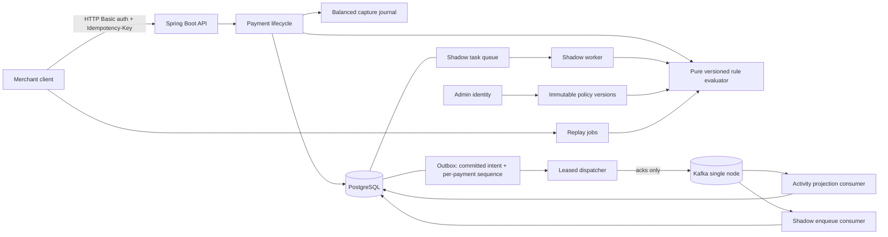

# Architecture and correctness boundaries

DecisionRail is a payment decisioning and resilience portfolio project using synthetic transactions. The transactional core guarantees that an authenticated payment command has a reproducible decision and a durable, explainable result. Checkpoints 4 to 6 add what happens *after* that commit: delivering the committed event, comparing alternative policies against history and live traffic, and behaving predictably when the new dependencies fail.

## System shape

Everything in the diagram is implemented. Note what the diagram does **not** show: no arrow runs from the broker, the shadow worker, or a replay job back into the payment lifecycle or the ledger. That absence is the central property of this phase, and architecture tests assert it rather than leaving it to review.

A browser is now a first-class client. The compiled dashboard is served by the same application from `/dashboard/`, and it calls a session-authenticated API at `/ui/**` that delegates to the same services the scripted `/v1/**` API uses. The two APIs have separate security chains on purpose, which [ADR 0005](adr/0005-browser-session-authentication.md) explains: a session cookie is attached automatically by the browser, so an endpoint a cookie authenticates can be forged from another origin, while a request carrying an `Authorization` header cannot. Keeping them apart means a session cookie buys nothing on `/v1/**`, Basic credentials are not accepted on `/ui/**`, and neither chain can silently borrow the other's protections.

The modules share one deployable Spring Boot application and one PostgreSQL transaction boundary. This keeps the payment lifecycle and ledger invariants enforceable while the codebase establishes domain boundaries. The system is intentionally a modular monolith at this stage.

## What crosses the commit boundary

A payment command does exactly one thing beyond its own state: it writes durable event intent with a per-payment sequence, in the same transaction. Everything else happens afterwards, driven from committed rows:

| Step | Transaction | Why it is placed there |
| --- | --- | --- |
| Decide, reserve, journal, write outbox intent | The payment transaction | These must agree or none of them may happen. |
| Claim a bounded batch of events and take a lease | Its own transaction, committed | The attempt count and lease must be durable before a network call. |
| Send to the broker and wait for an acknowledgement | **No transaction open** | Holding row locks across a broker round trip is how an async dependency becomes payment latency. |
| Record the delivery outcome under the lease token | Its own transaction | Fenced, so a worker whose lease expired cannot overwrite the new owner. |
| Consume: deduplication record plus projection effect | One transaction, then acknowledge the offset | The read model can never disagree with what was marked consumed. |

## Ordering, and what does not provide it

The outbox originally had no reliable order. The available signals are each insufficient:

| Signal | Why it is not an ordering guarantee |
| --- | --- |
| `occurred_at` timestamp | Ties lifecycle order to clock resolution and behaviour. Two events for one payment can share a microsecond. |
| Random event id | No order at all. |
| Kafka partition key | Keeps one payment's records on one partition, which a consumer needs to read them in order. Says nothing about the order a dispatcher offers them in. |
| `FOR UPDATE SKIP LOCKED` | Stops two workers taking the same row. Does not stop one worker taking sequence 2 while another is still sending sequence 1. |

The guarantee comes from a **durable per-payment sequence** assigned inside the committing payment transaction, while that transaction owns the payment row, plus one claim predicate: an event is claimable only when it is the lowest unpublished sequence for its payment. Because a claimed row is not published, that single rule gives both lifecycle order and at most one in-flight event per payment.

The same rule explains the failure mode honestly. A terminally failed event is also unpublished, so it **blocks exactly one payment's stream** until an operator redrives it, while every other payment keeps draining. Blocking is the deliberate choice: applying a payment's `captured` event when its `authorized` event was never delivered would build a read model from a gap.

## The delivery guarantee, stated precisely

**At-least-once delivery with idempotent consumer effects.** A crash between a broker acknowledgement and the outbox update resends the event, because no transaction spans PostgreSQL and Kafka. Consumers deduplicate by event id and commit that record together with their effect, so a resend changes nothing.

This is **not** end-to-end exactly-once processing, and no arrangement of these two systems without a shared transaction coordinator would be. The windows are named rather than hidden:

| Window | What happens | Why it is acceptable |
| --- | --- | --- |
| Acknowledged, crash before the outbox update | The row stays claimed until its lease expires, then is sent again | Consumers deduplicate by event id |
| Consumer committed, crash before the offset commit | The record is redelivered | The deduplication record makes the replay a no-op |
| Broker unreachable | Events accumulate as committed intent; payments keep working | Delivery resumes from durable state; backlog age is reported |
| Lease expired while a worker was still alive | The row is reclaimed and may be sent twice | Completions are fenced by lease token, so state is never overwritten |

## Replay and shadow isolation

Both features evaluate alternative policies. Neither can touch money.

- **Structural.** The replay and shadow packages do not depend on the payment service, the payment store, or the outbox. Architecture tests assert those dependencies stay absent, because isolation that rests on reviewer vigilance is not isolation.
- **Pure evaluation.** `evaluatePolicy(snapshot, input)` has no clock, no database, no I/O, and no random source. The same snapshot and input always produce the same evaluation, which is what makes a comparison meaningful.
- **Pinned inputs.** A replay job materialises its membership *and* the original inputs and baseline decision when it is created. Evaluation never reads today's account balance or hold to reconstruct a historical feature, and a payment committing later cannot join the job or move its denominator.
- **Baseline is the stored risk decision.** Never the payment's lifecycle status. A payment declined for insufficient funds recorded an `APPROVE` risk decision and is compared as one; treating its status as a policy decline would systematically overstate agreement with any strict candidate.
- **Derived work, not a callback.** Shadow work comes from committed authorization events in its own consumer group, so it survives restarts and cannot stall the projection consumer. Nothing on the authorization path waits for it, so a slow or throwing candidate cannot delay or fail a payment.

## What the dashboard adds, and what it does not

Checkpoint 7 added three read capabilities. Every change it can make is an existing operation reached through a second, session-authenticated route with its own CSRF protection; no new way to alter financial state was introduced, and no business rule was reimplemented in the browser:

| Addition | Why it could not reuse something existing |
| --- | --- |
| Merchant payment search | `/v1/activity` is a bounded list of an asynchronous projection. A payment must be findable the moment its transaction commits, including while the broker is down and nothing has been projected, so search reads the payments table. Paging is by keyset cursor, because payments are created continuously and an offset shifts under the reader. |
| Payment lifecycle timeline | The projection holds only a payment's latest state, so it cannot say what happened in what order. The timeline is assembled from the audit trail, the outbox rows with their durable sequence, and each consumer group's own deduplication records, and keeps those three distinct. |
| Administrative failed-event list | The backlog endpoint gives aggregate counts, which cannot be inspected or acted on. Choosing a redrive target needs the events themselves. |

Every mutation the dashboard performs goes through the existing `PaymentService`, `ReplayService`,
`ShadowService` and `PolicyService`. There is no second transaction boundary, no alternative financial
path, and no command implemented twice.

Two presentation rules follow from the domain rather than from taste. The stored risk decision and the
payment's financial status are shown as separate facts, because an APPROVE risk decision next to a
DECLINED payment is a normal, correct combination that collapsing them would hide. And a measurement
the server did not provide is rendered as unavailable rather than as zero, because a divergence rate
with no denominator is not zero divergence.

## Failure boundaries

| Failure | Effect on payments | Effect on the asynchronous path |
| --- | --- | --- |
| Broker unreachable | None. Commands succeed; decisions and holds are unchanged. | Breaker opens, claiming stops, backlog ages, health reports DEGRADED |
| Database unreachable | `503` with nothing reserved. Never a successful financial response. | Consumer blocks its partition rather than skipping an event |
| Dispatcher process dies | None | Lease expires, another worker reclaims and resends |
| Consumer dies after its commit | None | Redelivery is deduplicated |
| Candidate policy throws or hangs | None | The comparison records an error; the task retries then fails visibly |
| Replay worker dies mid-job | None | Job resumes from durable item state without duplicating results |

Liveness, readiness, and degraded asynchronous capability are three separate answers. Readiness includes the database, because no payment can succeed without it, and excludes the broker, because payments succeed while it is down. Folding broker health into readiness would remove a correct payment API from rotation during exactly the outage the outbox exists to survive.

## Transaction boundary

A payment mutation joins the following work in one database transaction:

1. Validate the authenticated merchant and command.
2. Claim or load the merchant-scoped idempotency key and compare the request fingerprint.
3. Lock the relevant account/payment state before a conflicting mutation can change it.
4. Evaluate or validate the payment transition and update the balance/hold state.
5. Persist the decision evidence and, for capture, the balanced journal entries.
6. Write the outbox record and durable HTTP result.
7. Commit before acknowledging the result to the caller.

A rolled-back transaction must not leave a successful payment without its journal, an isolated event, or a saved success response. See the implementation and integration tests for the exact order and storage details.

## Invariants that matter

| Boundary | Required property | Why it matters |
| --- | --- | --- |
| Merchant ownership | A merchant can only read or mutate its own payment state. | Authentication alone does not prevent cross-tenant access. |
| Idempotency | A key is scoped to a merchant and a stable request fingerprint. | A network retry must not create a second financial operation. |
| Key conflict | Reusing a key for a different operation or body is rejected. | Silent reuse could return a result for the wrong payment. |
| Available funds | Concurrent authorizations cannot reserve more than the available balance. | Correctness must hold under races, not only sequential demos. |
| Lifecycle | An authorization can reach a valid terminal state only once. | Competing capture/void requests must not both succeed. |
| Ledger | Each captured payment has a balanced journal in a single currency. | Money movement needs a durable accounting explanation. |
| Decision evidence | A stored result records the policy version and matched reasons. | A later rule change must not rewrite what happened. |
| Event durability | Outbox state commits with the payment mutation. | A dispatcher can retry delivery without losing committed events. |
| Event ordering | A durable per-payment sequence is assigned under the payment row lock, and only the lowest unpublished sequence is claimable. | A later lifecycle event must not overtake an unfinished earlier one. |
| Event identity | Identity and payload are immutable across retries and redrive; a published row cannot be rewritten. | Consumers deduplicate on identity, and delivery evidence must not be editable. |
| Lease fencing | Completions require the lease token the claim returned. | A stalled worker must not overwrite the state of the worker that took over. |
| Consumer effect | The deduplication record and the projection change commit together; the offset is acknowledged only afterwards. | A redelivery must produce no second effect, and a commit must not be lost to a skipped offset. |
| Policy immutability | A version identifier cannot be rebound to a different definition, and the built-in policy's hash is verified at startup. | Stored decisions name a version; that version must keep meaning the same thing. |
| Replay membership | Membership and inputs are materialised when the job is created. | A late commit must not change a job's population or its divergence denominator. |
| Comparison baseline | Always the stored risk decision, never the payment status. | A funding decline is not a policy decline. |
| Shadow isolation | No dependency on the payment service, payment store, or outbox. | Evaluating a candidate must not be able to move money. |
| Decision independence | Decisions are computed in process from committed state. | A broker or worker failure must not cause a fail-open decision. |

## Boundaries of this release

- Authorization reserves synthetic funds. Capture consumes the reservation and records the synthetic transfer. Void releases the reservation.
- The ledger represents the internal model; it is not bank settlement, scheme clearing, or a real connection to a payment network.
- Rules are deterministic, versioned policy checks. Their explanations are recorded evidence, not AI-generated justifications.
- HTTP Basic authentication is a development-friendly access boundary. Any public deployment must use TLS and deployment-specific credentials. Startup rejects missing application passwords or values shorter than 16 characters. Merchant and operations roles are separate; the metrics user cannot call merchant APIs. A later authentication milestone can add tokens without changing payment ownership checks.
- The broker is a single-node KRaft development deployment with replication factor 1. It is not highly available: a restart is a delivery outage and a lost volume is lost events. The outbox is what makes that survivable.
- A candidate policy is never authoritative. There is no promotion workflow and no code path that could make one decide a real payment.
- Replay and shadow reports contain no fraud accuracy metrics. No labelled outcome data exists for synthetic traffic, so precision, recall, and false-positive rates would be invented.
- Replay timings are observed values for a single run with no warmup control. They are not a benchmark.
- The operator console is a locally-scoped interface over synthetic data. Sessions are in memory, so a restart signs everyone out and more than one instance would need shared session storage. Credentials are the four environment-configured accounts; there is no user management and no rate limiting on sign-in.
- There is no refund lifecycle, reconciliation, distributed tracing, measured performance limit, failover system, or public hosted environment yet.

## Growth path

The event stream is now the seam for further asynchronous work. A new consumer joins with its own group and its own deduplication records, without touching the producer or the payment core.

The operator interface is built on that same data, and every change it offers is an existing operation behind a session-authenticated route rather than a new one. Remaining milestones build on what exists rather than revisiting it: correlated tracing and measured performance limits, refunds and reconciliation as new operations against the append-only ledger, and a hosting assessment.

Two things would justify revisiting this design. Consumers needing ordering *across* payments would require a different sequencing strategy than a per-aggregate counter. Measured backlog drain time exceeding what a single dispatcher can sustain would justify partitioned workers.

Service extraction is a later decision. Independent scaling or operational ownership would justify it; a larger container count would not.
