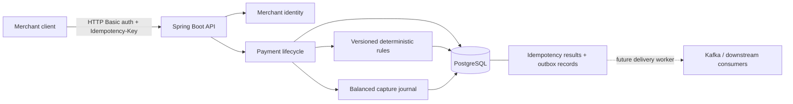

# Architecture and correctness boundaries

DecisionRail is a payment decisioning and resilience portfolio project using synthetic transactions. The first release concentrates on the transactional core: an authenticated payment command must have a reproducible decision and a durable, explainable result.

## System shape

Solid paths represent the first milestone. The dashed delivery path is planned; this release does not run Kafka or publish events to a broker.

The modules share one deployable Spring Boot application and one PostgreSQL transaction boundary. This keeps the payment lifecycle and ledger invariants enforceable while the codebase establishes domain boundaries. The system is intentionally a modular monolith at this stage.

## Transaction boundary

A payment mutation joins the following work in one database transaction:

1. Validate the authenticated merchant and command.
2. Claim or load the merchant-scoped idempotency key and compare the request fingerprint.
3. Lock the relevant account/payment state before a conflicting mutation can change it.
4. Evaluate or validate the payment transition and update the balance/hold state.
5. Persist the decision evidence and, for capture, the balanced journal entries.
6. Write the outbox record and durable HTTP result.
7. Commit before acknowledging the result to the caller.

A rolled-back transaction must not leave a successful payment without its journal, an isolated event, or a saved success response. See the implementation and integration tests for the exact order and storage details.

## Invariants that matter

| Boundary | Required property | Why it matters |
| --- | --- | --- |
| Merchant ownership | A merchant can only read or mutate its own payment state. | Authentication alone does not prevent cross-tenant access. |
| Idempotency | A key is scoped to a merchant and a stable request fingerprint. | A network retry must not create a second financial operation. |
| Key conflict | Reusing a key for a different operation or body is rejected. | Silent reuse could return a result for the wrong payment. |
| Available funds | Concurrent authorizations cannot reserve more than the available balance. | Correctness must hold under races, not only sequential demos. |
| Lifecycle | An authorization can reach a valid terminal state only once. | Competing capture/void requests must not both succeed. |
| Ledger | Each captured payment has a balanced journal in a single currency. | Money movement needs a durable accounting explanation. |
| Decision evidence | A stored result records the policy version and matched reasons. | A later rule change must not rewrite what happened. |
| Event durability | Outbox state commits with the payment mutation. | A later dispatcher can retry delivery without losing committed events. |

## Boundaries of this release

- Authorization reserves synthetic funds. Capture consumes the reservation and records the synthetic transfer. Void releases the reservation.
- The ledger represents the internal model; it is not bank settlement, scheme clearing, or a real connection to a payment network.
- Rules are deterministic, versioned policy checks. Their explanations are recorded evidence, not AI-generated justifications.
- HTTP Basic authentication is a development-friendly access boundary. Any public deployment must use TLS and deployment-specific credentials. Startup rejects missing application passwords or values shorter than 16 characters. Merchant and operations roles are separate; the metrics user cannot call merchant APIs. A later authentication milestone can add tokens without changing payment ownership checks.
- There is no outbox delivery worker, consumer deduplication, replay/shadow engine, refund lifecycle, failover system, or public hosted environment yet.

## Growth path

The transactional outbox is the seam for future asynchronous work. A later worker will read committed outbox rows and publish events with retry and duplicate-delivery handling. Consumers must remain idempotent; an outbox alone does not provide end-to-end exactly-once delivery.

A future replay/shadow module can evaluate immutable historical input with a selected policy version without altering the original payment or decision. Resilience experiments can then measure timeout behavior, retry amplification, degraded dependencies, and recovery against declared service objectives.

Service extraction is a later decision. Independent scaling or operational ownership would justify it; a larger container count would not.
